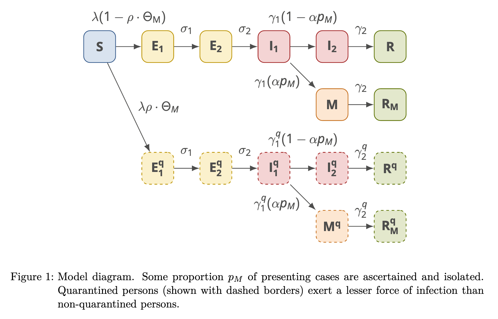

As the coronavirus pandemic spreads through 2020 and across the world, I find myself somewhat charmed to see the mathematics studied back in my university days make the news and can't help but reminisce. As such I decided to dust off the text books and reacquaint myself with modelling an epidemic.

## What is a compartmental model?

The basis for many epidemic models is compartmental modelling. These provide a framework for capturing different states an individual can exist in and the effects of moving between them. The simplest model used is what is known as the SIR model, which stands for Susceptible - Infected - Recovered.

The premise is, at any point in time an individual can be one of:
* Susceptible to being infected
* Infected and thus infectious
* Recovered (or removed) and no longer available to be infected

Over time individuals can move through each compartment and we can define the rates for this movement. This gives us the basis for our compartmental model:


graph LR;
    S(Susceptible) --Beta--> I(Infected)
    I --Gamma--> R(Recovered)
    style S fill:orange
    style I fill:red
    style R fill:lightgreen


Where by:
- $\beta$: The probability of a susceptible individual becoming infected upon interaction with an infected party
- $\gamma$: The rate at which infected individuals recover, also known as the recovery rate

Using this we can begin to build our model. Noting that the number of individuals in each compartment changes over time, we have:

- $ S(t) $ : The number of susceptible individuals at time $t$    
- $ I(t) $ : The number of infected individuals at time $t$    
- $ R(t) $ : The number of recovered individuals at time $t$    

Like every good mathematical model, let's add in some assumptions to make our life a little easier. Firstly, let's assume that the population remains static over time, thus:

$$ S(t) + I(t) + R(t) = N $$

And to make things even easier, let's represent it as proportions of the population rather than absolutes:

$$ S(t) + I(t) + R(t) = 1 $$

That's a good start, but what we really want to know is how people move between compartments and how the values for $\beta$ and $\gamma$ impact the outcome of an epidemic.

## Moving compartments

### Getting Infected
At any point in time the number of people getting infected is defined as the proportion that are susceptible interacting with the infectious group and getting infected at a rate of $\beta$, thus we get $\beta \times S(t) \times I(t)$.

### Recovering
Furthermore, at any point in time infectious people are recovering giving us $\gamma \times I(t)$

### Putting it all together
As the individuals getting infected and recovering are moving between groups, they allow us to define the rate of change for the population in each compartment:

$$ \frac{dS}{dt} = - \beta S(t) I(t) $$
$$ \frac{dI}{dt} = \beta S(t) I(t) - \gamma I(t) $$
$$ \frac{dR}{dt} =  \gamma I(t) $$

We now have the classic SIR model. So, what can we do with it?

## What does SIR tell us?

Before we get started, we need....

### Some more assumptions

At $t=0$ there has to be at least 1 infected individual otherwise there is no epidemic. Also, again to make the maths a little easier, we're going to assume that everyone else is susceptible. 

$$ S(0) \approx 1 $$
$$ I(0) > 0, \  I(0) \approx 0$$
$$ R(0) = 0 $$

### The rate of infection

Furthermore, at the start of an epidemic we need the number of people getting infected to be growing and thus have:

$$ \frac{dI}{dt} > 0 $$

Additionally, we can rearrange $I'(t)$ to get:

$$ \frac{dI}{dt} = I(\beta S - \gamma) $$

Noting that $I(t)$ is always positive, we can see that to satisfy a positive growth in the beginning we need:

$$ \beta S - \gamma > 0 $$

Given our prior assumption of $ S(0) \approx 1 $ and with some more rearranging we get:

$$ \frac{\beta}{\gamma} > 1 $$ 

In other words, for an epidemic to take-off we need the rate of people getting infected to exceed the rate of recovery. This is commonly referred to as the **basic reproductive ratio** and defined as:


$$ \frac{\beta}{\gamma} = R_0 > 1 $$ 

The average number of secondary cases arising from an average primary case in an entirely susceptible population


This seemingly simple number is key because it informs how fast an infectious disease grows and provides a basis to try and control it. In order to stop the spread of an epidemic, one must ensure people recover faster than new individuals are infected and through empirical calculation of the effective $R_0$ governments and policy makers can assess whether or not their measures are working.

This leads to our next question...

### How bad will it be?

Now we know how fast it will spread and how to control it, let's see if we can identify how big the epidemic will be. Using some mathematical jiggery pokery we can eliminate $I$, which will help us identify how big an epidemic is likely to grow. We do this by first dividing our equation for $R'$ into $S'$, which gives us:

$$ \frac{dS}{dR} = \frac{-\beta S}{\gamma}  = -R_0 S $$

If we assume that $R(0) = 0 $, integrating this gives us:

$$ S(t) = S(0) e^{-R_0R(t)} $$

At the end of an epidemic we'll assume there are no more infected individuals, thus $I(\infty) = 0 $. Furthermore the number of susceptible individuals remaining is the initial proportion minus whoever got infected, thus:

$$ As \ t \to \infty, \ S(\infty) = S(0) - R(\infty) $$

Finally, in our model the total number of people recovered is the total infected and thus a measure of how big an epidemic will be. This is referred to as the **Attack Rate** and will be represented by $A$. Subbing the above equation into our new equation for $S(t)$, and rearranging, we now get:

$$ A = S(0) - S(0)e^{-R_0A} $$

And remembering almost everyone started as susceptible we get:

$$ A = 1 - e^{-R_0A} $$

Solving this gives us a few interesting results:
1. There is no epidemic when the average number of secondary cases is less than one. The point at which $R_0$ surpasses 1 is known the as **epidemic threshold**
1. The attack rate grows with $R_0$ but is bounded by the number of initial susceptibles, $S(0)$
1. Not all epidemics result in everyone becoming infected. Another good reason to keep that infection rate down!

<iframe width="800" height="600" name="epidemic-threshold" src="epidemic_threshold.html" style="border:none;" ></iframe>

### Exploring the model

Now we have a feel for how big an epidemic might be and what the initial conditions need to look like for an epidemic to occur, let's take a look at how epidemics behave over time. 

Below is a numerical approximation of the SIR model, allowing us to see how the epidemic behaves and how changes to the infection and recovery rates impact the speed of the epidemic. Notice what happens when $\beta$ is less than $\gamma$? How about as $R_0$ grows?

<iframe width="800" height="600" scrolling="no" style="border:none;"  name="sir-curves" src="https://simple-sir-model.herokuapp.com/"></iframe>


If you want to explore further the [source code](https://github.com/diabolical-ninja/epidemic_sir_model) is available.


## This model is too simple, what about in real life?

Now obviously we've made some assumptions along the way, sanded off a few corners to make modelling a little easier but what about in real life where the corners are rough, people don't behave exactly as planned and governments can make policy decisions to interfere with the spread of the disease?

This is where the compartmental model becomes a really powerful tool. By following the same reasoning as with SIR we can introduce as many compartments as we like with different rates of movement, interactions and probabilistic behaviours.

### Let's add a vaccine

Let's say a vaccine was developed but we didn't have enough of it to vaccinate everyone. We can update our model to include vaccinated individuals heading straight to recovered and skipping the infectious stage. Our flow is updated to:


graph LR;
    S(Susceptible) --Beta--> I(Infected)
    I --Gamma--> R(Recovered)
    S --Rho--> R
    style S fill:orange
    style I fill:red
    style R fill:lightgreen


And our model system is also updated to reflect this:

$$ \frac{dS}{dt} = - \beta S(t) I(t) - \rho S(t) $$
$$ \frac{dI}{dt} = \beta S(t) I(t) - \gamma I(t) $$
$$ \frac{dR}{dt} =  \gamma I(t) + \rho S(t) $$

Furthermore, by experimenting with the value for $\rho$ we can figure out the proportion of the population that must be vaccinated to prevent the epidemic from occurring. This is known as **herd immunity**.

### What if people relapse?

What if recovered individuals are only immune for a period of time? What if those infected may either recover with or without immunity? We can update our model to accommodate this.


graph LR;
    S(Susceptible) --Beta--> I(Infected)
    I --Gamma--> R(Recovered)
    I --Omega--> S
    R --Rho--> S
    style S fill:orange
    style I fill:red
    style R fill:lightgreen


And our model system is also updated to reflect this:

$$ \frac{dS}{dt} = - \beta S(t) I(t) + \rho R(t) + \omega I(t) $$
$$ \frac{dI}{dt} = \beta S(t) I(t) - \gamma I(t) - \omega I(t) $$
$$ \frac{dR}{dt} =  \gamma I(t) - \rho R(t) $$

### And for Coronavirus?

In April 2020 the Doherty Institute [released their modelling](https://www.doherty.edu.au/uploads/content_doc/McVernon_Modelling_COVID-19_07Apr1_with_appendix.pdf) for the Australian government. As you can see their model is considerably more complex but it's built off the same principles as we've discussed.

### A couple of considerations

While these models may appear like exact representations of an epidemic they are filled with assumptions and should be treated as nothing more than a guiding tool. They are only as good as the assumptions we give it and allow us to simulate different policies, disease characteristics and more to understand potential outcomes.

In practise the parameters for infection rate, recovery rate and any other parameter used is estimated based on observed data. Furthermore, distributions tend to be used for each parameter with hundreds or thousands of simulations being run drawing from those distributions to understand potential epidemic outcomes.

## References

Here we've really only started to scratch the surface of how compartmental models can be used for modelling epidemics.

For those interested in the modelling used by the Australian government to inform the original COVID19 response, the Doherty Institute [released their research](https://www.doherty.edu.au/uploads/content_doc/McVernon_Modelling_COVID-19_07Apr1_with_appendix.pdf) and you can see this approach to modelling at work, albeit with a tad more complexity.

- [Assessing the risk of spread of COVID-19 to the Asia Pacificregion](https://www.doherty.edu.au/uploads/content_doc/Geard_importation_risk_assessment_COVID19_Apr7.pdf)
- [Estimating the case detection rate and temporal variation in transmission of COVID-19 in Australia Technical Report 14th April 2020](https://www.doherty.edu.au/uploads/content_doc/Estimating_changes_in_the_transmission_of_COVID-19_April14-public-release.pdf)

Additionally, for those looking to learn more the book [Modeling Infectious Diseases in Humans and Animals](https://press.princeton.edu/books/hardcover/9780691116174/modeling-infectious-diseases-in-humans-and-animals) by Matt J. Keeling and Pejman Rohani is an excellent read and great introduction to mathematical modelling of diseases, covering compartmental models discussed here and its many variations.

