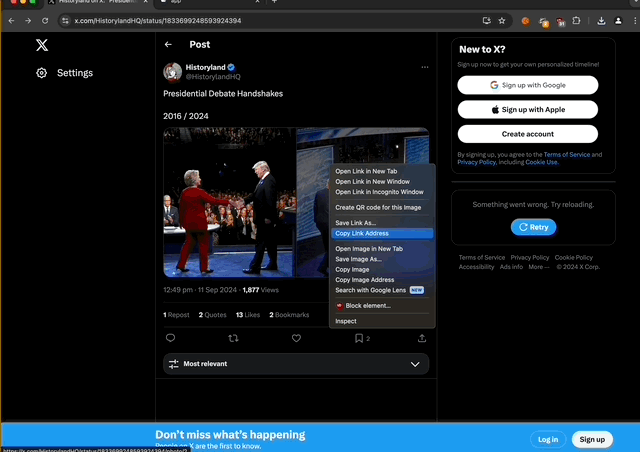
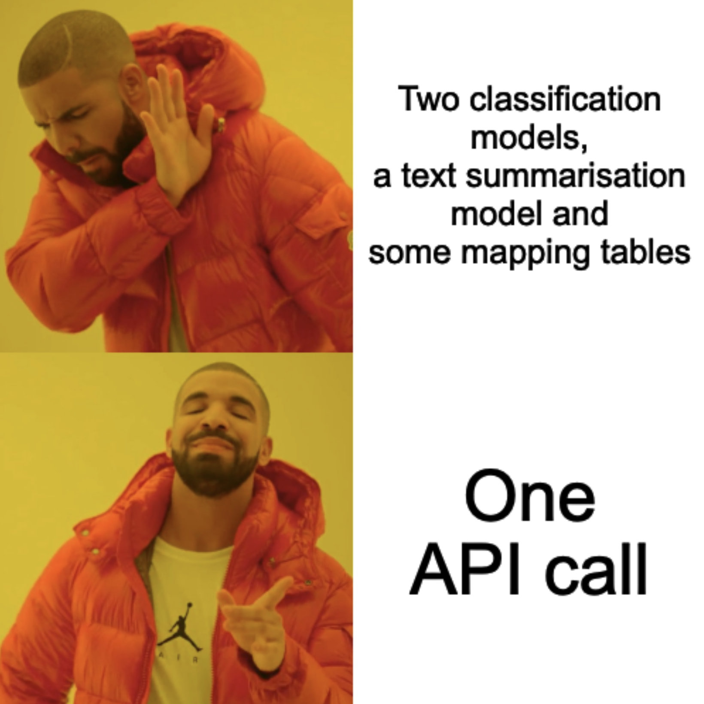

One group of friends loves to debate politics, policy and bias. The most common catalyst for this is a tweet. Is this tweet too left? Too right? Does it capture the truth, the whole truth and nothing but the truth? Unsurprisingly it’s very, very rare for us to agree, it’s politics after all. And, while fun, there are times we need to conclude a debate but without a mediator that can be hard.

Since the launch of ChatGPT one of the few things we’ve agreed on is that what the LLM says, goes. As ridiculous as it sounds, they’ve become our mediator. We finally have a way to conclude our debates. There was only one problem; I’m lazy and I didn’t want to type out a prompt every time someone linked to a tweet.


TweetChecker is all open source: [Find me on Github](https://github.com/diabolical-ninja/tweet-checker)


## Give it a try
Before we get into the nitty gritty, try it out at: https://tweet-checker.onrender.com/

# Welcome TweetChecker™ 

Introducing TweetChecker™, your one stop shop for bias and accuracy evaluation of tweets*. Paste in some tweet text, add its attachments, choose your model and you’re off to the races.

  

*While it’s called TweetChecker you could provide any document; news, blog, facebook post, etc.


...you’re right. Ideally you’d link to a tweet but while I’m lazy I’m also cheap and didn’t want to pay US$100/month to read tweets programmatically. 


## What is the TweetChecker™?

At its heart it's a basic LLM prompt:  
`Assess the following tweet for bias. Perform the following tasks:`  
`- Rate it on a scale between 1 (very left) & 10 (very right) with 5 being neutral.`   
`- Where possible rate the factual accuracy of the tweet with 1 being very incorrect & 5 being very correct.`   
`- Provide a summary of the tweet, and highlight all excessively left or right leaning points.` 

`{format_instructions}`

`The tweet had {num_attachments} attachments. The tweet is as follows:`

`{tweet}`
  
For a given input (tweet text) we should* receive the following elements:  

- **Bias:**
  - `Rating`: Bias rating between 1 and 10
  - `Spectrum`: Spectrum of bias (left learning, neutral, right leaning)

- **FactualAccuracy:**
  - `Rating`: Factual accuracy rating between 1 and 5
  - `Description`: Description of the accuracy rating

- **TweetAnalysis:**
  - `Bias`: Bias from above
  - `Accuracy`: FactualAccuracy from above
  - `Summary`: Summary of the tweet

 
*Should, because LLMs don’t guarantee a response format.

## Wowsers that was easy!

While TweetChecker™ is obviously a little toy it does showcase the order of magnitude productivity gain that LLMs can provide. TweetChecker™ is essentially one API call. Instructions are provided to an LLM and the tweet, with its attachments, are added as context. That’s it!

To achieve this in the pre-LLM era we would have required:

1. A model to parse text and categorise bias  
2. A mapping of bias score (1..10) to bias label (neutral, very left, etc)  
3. A model to parse text and categorise factual accuracy  
4. A descriptive summary of the factual accuracy  
5. A model to summarise the tweet, its attachments and articulate the context that produced items 1 through 4

So, 2 classification models, a text summarisation model and some mapping tables. Each model would have required data labelling, training, testing and many iterations until the performance of each was acceptable. Finally it would have required a more complex application to deploy all models and plumb the pipeline together.

The comparison is striking; minutes of work vs days/weeks and a significantly simpler solution.  

  

  


They both have challenges regarding accuracy, reliability and interpretability. The tradeoffs for each system would need to be considered for a real world application. 


## Hold up, hold up, hold up;

Yes, this is obviously ridiculous. There's no verification, no true fact checking and zero controls. There are some pretty obvious questions you're likely asking right now so let's try to answer them:

* How accurate is it? 🤷🏾  
* But don’t the different models have different biases? Yes, they absolutely do. I did mention it’s ridiculous.
* Is the LLM knowledge base up to date? No, not it’s not. See above re-ridiculousness.
* Why on earth should I trust this? You absolutely shouldn't!

# Have a play!

Head over [here](https://tweet-checker.onrender.com/), go wild, test it out, share your thoughts! Just note, the app will break once the API keys used run out of funds and if you’ve read this far you’ll know my thoughts on spending money. Happy chatting 😀