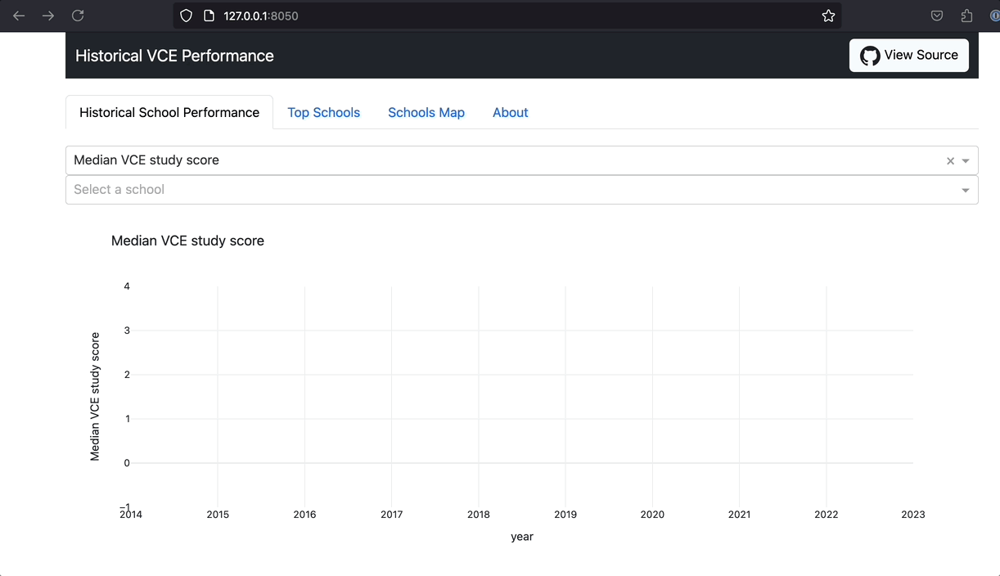
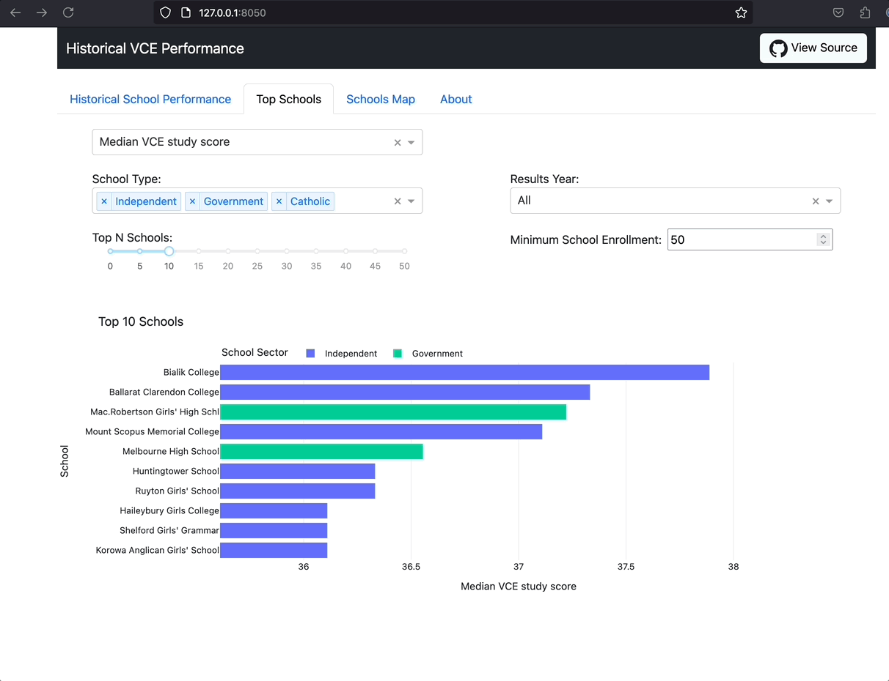
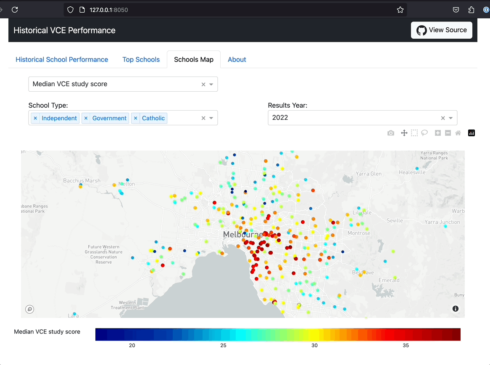

As a recent parent, so many new questions have started occupying all of my thoughts from “where’s the nearest playground” to “is this safe for a toddler”. But most of all I’ve been wondering about the future. What do we as parents have to do now to ensure our children can live out their best futures? Chief among that is determining what are the best schools.

There are so many ways to define "the best" school; academic performance, extra-curricular opportunities, teaching methodology, alumni outcomes, and on and on and on. There is no "right" approach. Even if we could define “the best” there’s unfortunately very little public data available to answer most of these empirically. 

For those in Victoria, the richest source I’ve found is from the Victorian Curriculum and Assessment Authority (VCAA) who provide year 12 summary outcomes for each school across the state. As such, here is where our journey starts!


If you'd like to look under the covers it's all open source: [VCE School Performance](https://github.com/diabolical-ninja/vce-performance)


## Give it a try
Before we get into the nitty gritty, try it out at: https://vce-performance.onrender.com/

# The Data
At the end of each school year the [VCAA](https://www.vcaa.vic.edu.au) publishes the [Secondary Completion and Achievement Information](https://www.vcaa.vic.edu.au/administration/research-and-statistics/Pages/SeniorSecondaryCompletion.aspx) which provides “data on…student cohorts and student achievements of schools delivering the Victorian Certificate of Education (VCE)...” for each school in the state. With data going back to 2014 it helps provide a window into year on year school performance and with it we can answer questions such as:

- How many students completed VCE or VET?
- What was the median VCE study score?
- How many over 40 study scores were there?
- How many students applied for university?

With such a focus on academic outcomes it only provides one piece of the puzzle. Academic performance isn’t the result of the school alone but reflective of the parents educational backgrounds, their resources, and more, all of which are significant contributors to student outcomes. 

## Supplementary Data
ACARA, The Australian Curriculum, Assessment and Reporting Authority or more commonly known as the government body behind NAPLAN, also publishes a handy amount of school profile information such as the economic profile of the school cohort, the school type (independent, government or Catholic), staff counts and more. With it, we can supplement the academic achievement data we have above.

## Hold up, what about NAPLAN?

Excellent question! I too wondered about NAPLAN and you can view an individual schools performance at [myschool.edu.au](https://www.myschool.edu.au/). Unfortunately it doesn’t allow you to compare schools (in fact it discourages this) and there is no option for exporting data. Reaching out to [ACARA](https://www.acara.edu.au/) for a copy of the data I was told “The Data Request Program is not intended to provide data for personal use” and that “...data access protocols are intended to facilitate quality research and maximise benefits to students…”. So I guess the exercise of identifying the best school for your child is not a quality research exercise?

ACARA also publishes school finance details but alas that too cannot be trusted in the hands of the public. 

# What is a study score?
Given the bulk of our data talks to academic performance, specifically study scores, I’d like to take a quick detour to explain what a study score is. 

For each subject a student takes in year 12 they receive a study score, a number between 0 and 50, representing their relative performance to all other students across the state who took that subject. The study score is drawn from a normal curve with a mean of 30. Around two-thirds of students will receive a score between 23 and 37 and a score of 40 or above puts a student in the top 9%.

Throughout the year students complete in-class tests and take home assignments, finishing the year with an exam. The students' performance on each of these assessments is compared to the state average and standard deviation to give a weighted standardised general assessment score (WSGAS). The sum of these is then ranked alongside all students who took that subject and their relative position mapped to the score distribution.

The WSAGS calculation is:

$$ \text{Sum(WSAGS)} = \sum_{n=0}^{\text{\\# Assessments}} \frac{\text{Assessment Score} - \text{State Average}}{\text{Standard Deviation}} \times \text{Assessment Weighting} $$

For more information this VCAA explanation is quite helpful https://www.vcaa.vic.edu.au/assessment/results/Pages/StudyScoreVideos.aspx. 

# Whats it do?
Alright, with all the data talk out of the way let's get to using it. It's pretty simple really, you can view metrics over time, a stack rank of schools and see how that changes geographically. Let's dive in!

## Longitudinal Performance 
The first view shows a chosen metric over time. Number of enrolments, median study score, percentage of VCE completions etc and it allows you to compare multiple schools. This is useful for understanding whether a school is a consistent high performer or whether it was one cohort that pushed them up or down. 
    

  

 
## Rankings 
We all love a winner right? Well here we go! Number one in study score? Gotchya! Highest VCE completions? Gotchya! What about for government schools only? Done! 

  

## The map!

Here we can see where each school is located and start to interrogate if and how geography plays a role in outcomes. City vs country? Western suburbs vs eastern suburbs? The list goes on.

Personally, this is what I found most interesting (and also least surprising). We all probably could have guessed that in Melbourne the schools that top the charts all huddle around the inner south-east. We can back that up when we visually see how ICSEA correlates with Median Study Score. 

The map shows so much more though, for example there’s a much greater density of schools in the eastern suburbs than the west. Given the population boom happening in the west what will that mean for the schools out there? 

  

# What'd we learn?
A few observations jump off the page straight away, most of which are common knowledge (this isn't a bad thing, it's a useful grounding to show that our analysis is behaving correctly). 

1. The high priced private schools top the list time and time again. Catholic, Jewish and Independent. With all the resources available and an ability to apply selective enrolments it would be concerning if that didn't result in chart topping results!
2. The select entry public schools nip at the heels of the high priced private schools. This really isn't a surprise given they scoop up the best and brightest across the state.
3. Once past these two groups of schools there's very little difference between public and private school results. Whether the additional fees (often significantly so) are worth it will be up to you but they don't necessarily translate to improved VCE outcomes. 

The most striking insights though are from the map: 
- School density follows the suburbs SES. There are more schools in the east than in the north than in the west. It follows the growth of Melbourne over time but highlights the massive demand for schools out west. Government schools, select entry and private schools; they're all lacking in the west. 
- The top performing schools are all in the inner south east. There's a pocket of public and private schools in the inner south east that dominate for percentage of study scores over 40, and thus median study score. They “own the market”

As a parting note, please remember that there are so, so many factors to consider that are not captured here. Parents educational backgrounds, school funding, the cohort and more. That being said, hopefully these insights are helpful in assessing the right school for you and your family in what is a complex, multifaceted and nuanced decision.
