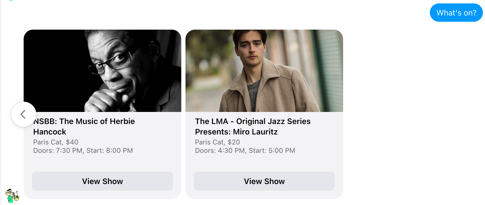
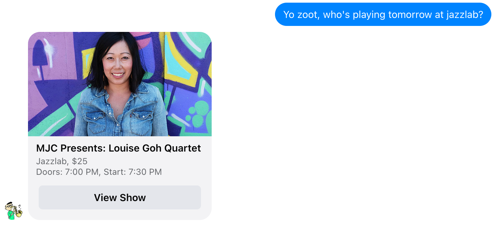
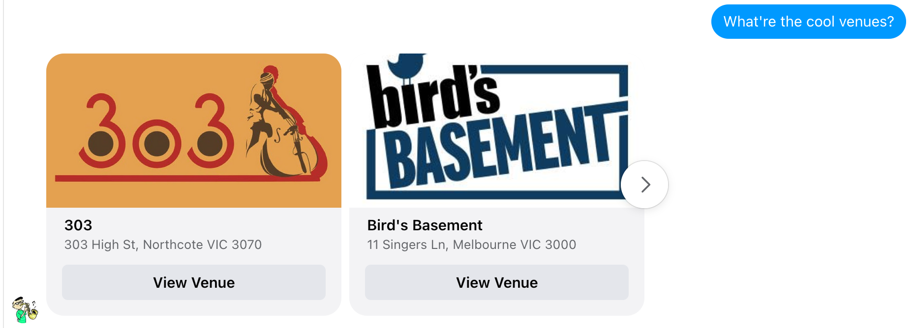
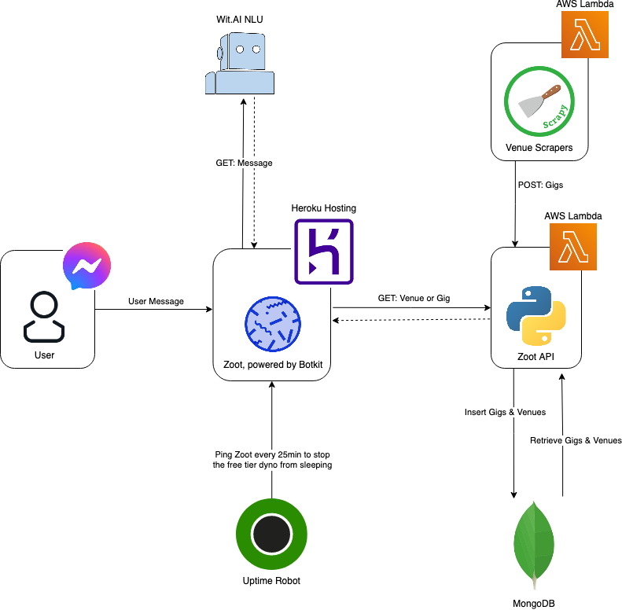

Outside of data, a huge passion of mine is music, in particular jazz. In Melbourne we're fortunate to have quite a few establishments that support live music and offer amazing shows every night of the week. But this raises a problem; who to see? Where to go? What's on?!

Friends and I constantly found ourselves returning to the same venue websites over and over every time we tried to figure out who to see and at the same time the same thought kept popping up; "you know who's great at doing the same thing over and over again? Computers!" So without further ado I'd like to introduce you to [Zoot](https://m.me/rootytootyzooty), you're friendly neighbourhood jazzbot.


If you'd like to look under the covers it's all open source: [Zooty Tooty](https://github.com/zootytooty)



Also, a big shout out to [Trent](https://github.com/trent-howard) & [Pete](https://github.com/petergreco), who without there would not be a Zoot!


# Say hi Zoot 👋🏽

Before we get into all the nitty gritty lets have some fun & give Zoot a whirl. You can chat with zoot on facebook at . 


## What's On?
The simplest way to get started is to ask `What's on?` for all the shows available today. For example:



If you want to get a little fancy you can even specify a venue or a day (or both!)



## Where to go?

You can also find where the cool joints are around town. How? Just ask Zoot!





Full help and how-to details are available on [Zoot's homepage](https://zootytooty.github.io/zoothome/)



# So, what's a Zoot?

At heart of it there are three core parts that make up Zoot; getting the gig info, the chat interface and some smarts to figure out what's going on.

## Scrape, Scrape, Scrape

[View Source](https://github.com/zootytooty/ScrapeFromTheApe)

Quite possibly the main prompt for building Zoot was that a database or calendar of gigs around Melbourne does not exist. This meant that before we could really do anything we needed to build that database and that meant a whole lot of web scraping. Picking out our favourite venues across town, a scraper was written to extract and clean the data needed into something we could build Zoot around. Each show, after scraping would look like:

```json
{
        "title": "ANITA WARDELL",
        "venue": "paris_cat",
        "description": "Paris Cat serves up London based Anita Wardell, recipient of the BBC's Best of Jazz award for a night of high stakes singing. Jazz standards, vocalise, swinging bebop, and more. Anita is regarded as a master of her art.  She will be joined by the fabulous trio of Dave McEvoy on piano, Frank DiSario on bass and Ronny Ferella on drums. A night not to miss! Dave McEvoy (piano),  Frank DiSario (bass) and  Ronny Ferella (drums). http://www.anitawardell.com/https://soundcloud.com/anitawardell Genre - Jazz/Swing/Bebop Performance Room - Basement",
        "performance_date": "2020-08-21",
        "doors_open": "21:00",
        "music_starts": "21:30",
        "price": 40.0,
        "url": "https://roller.app/pariscat/product/506177?date=20210821",
        "image_url": "https://cdn.rollerdigital.com/image/7TYsiH4Owk-_Iy8vgq9-0g.jpg"
    }
```

In future versions it would be fantastic to also collect the genre, musician names, the instrumentation and a whole host of other details to create tailored recommendations of what and who to see.


## I've got some data, but how do I access it?

In order to store, save and access any of this gig information we needed a database and a way of interacting with it. In the spirit of KISS we put a little REST API over the database mainly to federate the features we could support. For example, in the future it would be great to allow users to add their own gigs to the database. Rather than rebuilding that functionality in the bot or a website, having to accounting for duplicates, formatting and everything else required, a simple call to the same API used by the scraper ensures seamless consistency.

As it currently stands Zoot's API supports:

* `GET gigs/`: Returns the shows of interest filtered by date and venue (if desired)
* `POST gigs`: Adds shows to the database, accounting for the possibility of duplicates
* `GET venues/`: Returns all venues
* `POST venues/`: Adds a venue to the database, accounting for the possibility of duplicates


## Lets Have a Chat

[View Source](https://github.com/zootytooty/BeBot)

In order for any of this to work we needed a way for users to chat with Zoot. Would it be SMS? Do we build an app? Our choice was to use Facebook Messenger because of the incredibly large existing user base, the support they have for chatbots and that it simplified what we needed to build. It meant we didn't have to write or manage any new services that would directly face users. It's plug and play, and that's great!


## Machine learning to the rescue...sort of

[View Source](https://github.com/zootytooty/WitTrane)

Whenever someone sends Zoot a message we need to figure out what they're asking and whether there are any special words or context they're providing. If someone says "Yo Zoot, who's playing tomorrow at jazzlab?" we need to know they're interested in `Whats On`, specifically `tomorrow` and at the venue `Jazzlab`.

Often this is done by looking for keywords or phrases, for example assuming if `hi, hello or hey` are present then respond with your welcome message. Unfortunately this approach can quickly fall down because of multiple keywords or typos from users. Using the example above, is the user saying Hi or asking what's on? What if they miss a *"z"* in `jazlab`? It's easy for us to see the intent, see the similarity but it's much harder for computers. What would be ideal is if rather than looking for specific keywords we could build a more general understanding of the message intent and what it's asking.

Fortunately a bunch of smart folk in the machine learning community have thought of this and developed something called Natural Language Understanding (NLU). For us there were two tools in the NLU toolkit of particular interest.

### Intent Classification

The goal here is to be able to tag a sentence or user message with the general intent of the request. A single intent, for example "What's On?" could be phrased multiple ways and we want to learn that they all have the same meaning. If someone says "what's on", "who's playing tonight" or "what's crackalackin'" we want to learn they all share the same intent. For Zoot we have four intents:

* `whats_on`: For messages asking what's on, where and when
* `venues`: When people what to know all venues around town
* `help`: To return a link to our [help page](https://zootytooty.github.io/zoothome/)
* `hello`: Just being a friendly little Zoot 😃 


### Named Entity Recognition (NER)

Within each message there are attributes (or entities) we want to extract that let us know the finer details of the users request. Again going back to our example above there are two important entities we want to be aware of.

Yo Zoot, who's playing `tomorrow` at `jazzlab`?
* `Date`: We want to understand the date context of a message. Tomorrow, today, next week, on Thursday, etc. 
* `Venue`: By knowing the venue the user is interested in we can refine what Zoot returns


### Wit.AI

Rather than building our own models we used a service from Facebook called [Wit.ai](https://wit.ai/), which allowed us to provide sample user messages and tag them with the appropriate intent and entity/s. With those it was able learn this general understanding of what users were asking for and allowed us to respond a little smarter than if we stuck with only keywords.

We trained Wit by sending many, many samples and built templates that allowed us to iterate across every possible combination of intent and entity. For example, one template for the `whats_on` intent was "Are there any gigs {entities_wit$datetime:datetime} at {traits_venue}", which generated samples such as:
* Are there any gigs `tomorrow` at `Jazzlab`
* Are there any gigs `next wednesday` at `Moldy Fig`
* Are there any gigs `tonight` at `Paris Cat`

Once trained, we could call Wit's API with user messages and it would provide a breakdown of what the intents, entities and their respective confidences were. For example
```json
{
    "text": "Who's playing at birds basement tomorrow",
    "intents": [
        {
            "id": "240179067977375",
            "name": "whats_on",
            "confidence": 1
        }
    ],
    "entities": {
        "wit$datetime:datetime": [
            {
                "id": "871058740461194",
                "name": "wit$datetime",
                "role": "datetime",
                "start": 32,
                "end": 40,
                "body": "tomorrow",
                "confidence": 0.9666,
                "entities": [],
                "type": "value",
                "grain": "day",
                "value": "2021-08-22T00:00:00.000+10:00",
                "values": [
                    {
                        "type": "value",
                        "grain": "day",
                        "value": "2021-08-22T00:00:00.000+10:00"
                    }
                ]
            }
        ]
    },
    "traits": {
        "venue": [
            {
                "id": "516705612770815",
                "value": "birds_basement",
                "confidence": 0.9993
            }
        ]
    }
}
```


Wit breaks entities down further into entities and traits but for the purpose of Zoot you can consider them one and the same.



### This all seems great. What's the problem then?

No system is perfect, be it the keyword approach or rolling out the big guns that are machine learning. In the first attempt to train Wit it seemingly got more and more confused as we provided additional samples to learn from. Eventually it got to the point where it was unable to reliably identify the correct intent or entity. As in this example, where not only is the intent wrong, the confidence in what is returned is incredibly low.

```json
{
    "text": "What're the cool venues?",
    "intents": [
        {
            "id": "219813300063570",
            "name": "hello",
            "confidence": 0.274
        }
    ],
    "entities": {},
    "traits": {}
}
```

For us the solution was quite ham-fisted. We purged Wit and trained it again. While this was successful I really cannot say why! If using this in your workplace, I would strongly suggest the use of test cases to validate what has been learnt and ensure it matches your desired functionality.


# Putting it all together

When we glue all those bits and pieces together we get something that looks like this.



The nice thing here is that it's incredibly easy to deploy, all being built off serverless services and if, by some miracle, Zoot turns out to be a wild success we can quickly and easily scale as far out as our credit cards will permit without having to change a thing in the architecture.


## How good is free?

An overarching consideration when making our technology and infrastructure choices was "is it easy?" and "is it free?". With everything being serverless it meant we could focus on building Zoot & its functionality rather than building infrastructure. It also meant we could say:

* Why MongoDB Atlas? Because their free tier is fantastic
* Why Heroku to host Zoot? Because their free tier is fantastic
* Why AWS Lambda? Because the free tier is fantastic
* Why Wit.AI? Because it's 100% free
* Why Facebook Messenger? Because it's 100% free

Notice a pattern here?


# Have a play

Have a play, chat with [Zoot](https://m.me/rootytootyzooty) and if you're feeling really adventurous we'd love a few extra hands to increase the number venues!